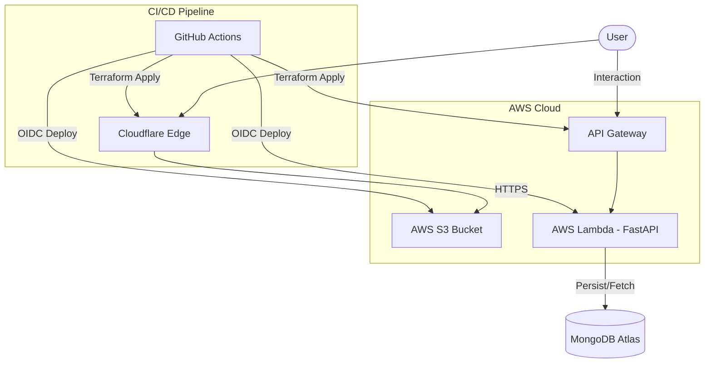

# ☁️ Cloud Resume Challenge - James Adewara

A production-grade, serverless resume implementation built with modern cloud-native principles. This project showcases a high-performance frontend, a scalable Python API, and fully automated **Infrastructure-as-Code (IaC)** deployment.

## 📐 Architecture

## 🛠️ Tech Stack

- **Frontend**: HTML5, Vanilla CSS3, JavaScript (S3 + Cloudflare)
- **Backend**: Python 3.12 (FastAPI), AWS Lambda
- **Database**: MongoDB Atlas (External)
- **IaC**: Terraform (Modular HCL)
- **CI/CD**: GitHub Actions (OIDC Authentication)
- **Security**: Cloudflare SSL (Flexible), IAM Least Privilege, OIDC (No long-lived keys)

## 📂 Repositories

| Repository | Purpose |
| :--- | :--- |
| [**`cloud-resume-challenge-iac`**](./cloud-resume-challenge-iac) | Provisions AWS (S3, Lambda, IAM, API GW) and Cloudflare DNS. |
| [**`cloud-resume-challenge-backend`**](./cloud-resume-challenge-backend) | Serverless Python API for the visitor counter and health checks. |
| [**`cloud-resume-challenge-resume`**](./cloud-resume-challenge-resume) | Responsive frontend resume assets. |

## 🚀 Deployment Overview

1. **Infrastructure**: Provision the core resources using Terraform in the `iac` repo.
2. **Backend**: Deploy the FastAPI app via the `backend` repo CI/CD.
3. **Frontend**: Sync assets to S3 via the `resume` repo CI/CD.

## 🔒 Security First

- **Zero Credentials in Git**: All sensitive values are managed via GitHub Secrets and Terraform variables.
- **OIDC**: AWS access is granted dynamically to GitHub Actions using OpenID Connect, eliminating the need for permanent AWS Access Keys.

---
*Developed as part of the [Cloud Resume Challenge](https://cloudresumechallenge.dev/).*